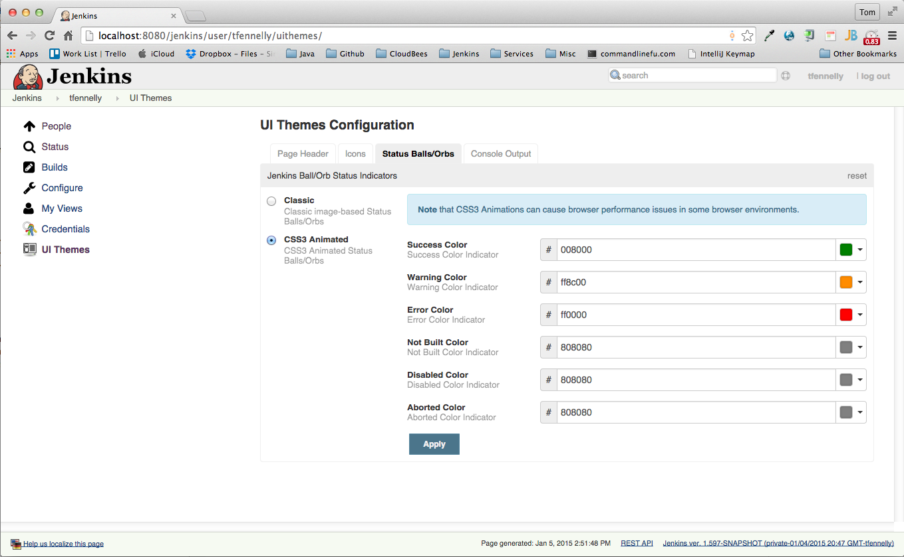
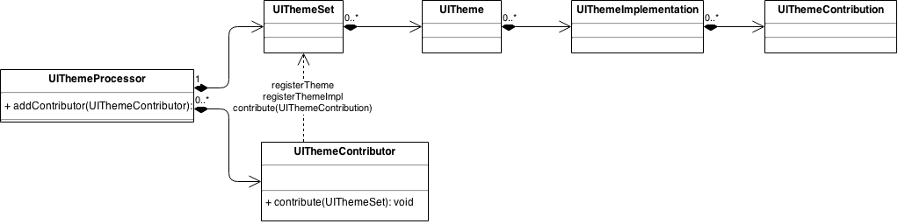

# Jenkins UI Themes

# The plugin has been suspended and can no longer be installed.

This repository contains components that, when combined, provide the basis on which Jenkins can offer
per-login customizable/configurable UI "themes".

We've already integrated it into Jenkins Core on a WIP branch at [tfennelly:JENKINS-24143-uithemes-v2][JENKINS-24143-uithemes-v2].

> __[Here's a short video](https://youtu.be/ZlD0zf1VCAs)__.

__NOTE: This plugin will not work on Jenkins until the changes in [tfennelly:JENKINS-24143-uithemes-v2][JENKINS-24143-uithemes-v2] are pushed upstream and released. Once that happens, we'll set a minimum version dependency on this plugin.__

The following is an example screennshot of the user UI Themes Configuration screen on [tfennelly:JENKINS-24143-uithemes-v2](https://github.com/tfennelly/jenkins/tree/JENKINS-24143-uithemes-v2).

[tfennelly:JENKINS-24143-uithemes-v2](https://github.com/tfennelly/jenkins/tree/JENKINS-24143-uithemes-v2) contains a number of themes, some of which have multiple
implementations:

* __Page Header__: Page header theme. Two implementations:
    * Classic: The standard black header and logo. Logo, background and font color are configurable. (defined in Jenkins core)
    * Lite: A lighter colored implementation (as in screenshot above). Logo is configurable. (defined in Jenkins core)
* __Icons__: Icons theme. Two implementations:
    * Classic: The standard Jenkins icons. (defined in Jenkins core)
    * Font Awesome: A set of icons derived from the [Font Awesome](http://fortawesome.github.io/Font-Awesome/) scalable vector icons (as in screenshot above). Defined in [font-awesome-icons-plugin].
* __Status Balls/Orbs__: Status indicators e.g. build status. Two implementations:
    * Classic: The image based icons. (defined in Jenkins core)
    * CSS3 Animations: Pure CSS3 animated status icons i.e. no images required. All status colors are configurable, allowing color blind users to configure to taste (see config screen in above screenshot). (defined in Jenkins core)
* __Console__: Console/terminal output theme. Two implementations:
    * Classic: The standard console styling with a white background. (defined in Jenkins core)
    * Dark: A dark version from Kevin Burke's (@kevinburke) Jenkins pull request [#1272](https://github.com/jenkinsci/jenkins/pull/1272). (defined in Jenkins core)

## Configuring Theme Config Defaults

If a given user has not configured a theme implementation, this plugin will check for that theme implementation config on the `anonymous` user and will use that if present.
Therefore, if you want to configure e.g. the default icon in the top navbar for all users, simply configure the relevant theme implementations on the `anonymous` user.

## Registering and Contributing to Themes

UI Themes are built around the following basic data model (defined in the [processor](./processor) module). Other relationships could be shown, but these are the important ones.

Three types of additions can be made to the model:

1. __Registering a new Theme__ (`UITheme`). It seems like this should only ever be done from inside Jenkins Core e.g. registering of the "Icons" theme.
1. __Registering a new Theme Implementation__ (`UIThemeImplementation`). This can be performed by Jenkins Core or by a Jenkins Plugin e.g. registering of the "Classic" theme implementation on the "Icons" theme (done from Jenkins core), or registering of the "Font Awesome" theme implementation on the "Icons" theme (done from the [font-awesome-icons-plugin]).
1. __Contributing to a Theme Implementation__ (`UIThemeContribution`). This can be performed by Jenkins Core or by a Jenkins Plugin e.g. Jenkins Core contributes the core set of icon definitions to the "Classic" theme implementation, while plugins also make contributions to the "Classic" theme implementation by contributing the plugin specific icon definitions.

An example of how the above model hierarchy might look:

* __icons__ (Theme - registered from Jenkins Core)
    * __classic__ (Theme Implementation - registered from Jenkins Core)
        * __classic-icons-core__ (Theme Implementation Contribution - from Jenkins Core)
        * __classic-icons-uithemes__ (Theme Implementation Contribution - from the [uithemes-plugin][uithemes-contributions])
    * __font-awesome-icons__ (Theme Implementation - registered from the [font-awesome-icons-plugin][fontawesome-plugin])
        * __font-awesome-icons-core__ (Theme Implementation Contribution - from the [font-awesome-icons-plugin][fontawesome-plugin])
        * __font-awesome-icons-uithemes__ (Theme Implementation Contribution - from the [uithemes-plugin][uithemes-contributions])

As stated above, both Jenkins Core and Jenkins Plugins can contribute to UI Themes (#2 and #3 above). At present however, it does not seem to make sense for anything other than Jenkins Core to register new themes (#1 above).
This is because registering a new theme typically also involves refactoring out existing core styles (defined in `styles.css`) into a `theme-template.less` file ([LESS](http://lesscss.org/)) used by the
"Classic" theme contribution (by convention, the original/default styles become the "Classic" implementation).

* To see how Jenkins Core currently contributes to UI Themes, see the `CoreThemeInstaller` class in Jenkins Core.
* To see how Jenkins Plugins can contribute to UI Themes, see the next section in this readme.

## How can Plugins contribute to UI Themes?

By getting their Jenkins `Plugin` class to implement the `UIThemeContributor` interface. Once they do this, they will be able to register new `UIThemeImplementation`s and/or contribute to
existing implementations (`UIThemeContribution`).

Note that we do not think Plugins should register new themes i.e. they should stick to just registerin new theme implementations and contributing to theme implementations! See the previous section titled __Registering and Contributing to Themes__.

An example of a plugin that both registers a new theme implementation and also contributes to that theme is the [font-awesome-icons-plugin]:

* [PluginImpl][fontawesome-plugin]:
    1. Registers the `font-awesome-icons` theme implementation to the `icons` theme.
    2. Makes the `font-awesome-icons-core` contribution to `font-awesome-icons`.
* [theme-template.less][fontawesome-less]:
    1. Defines the [LESS](http://lesscss.org/) resource used to build the CSS that becomes the physical style contribution.

An example of a plugin that only contributes to existing theme implementations (i.e. does not register any) would be this plugin itself (uithemes).  See [UIThemesPlugin.contribute()][uithemes-contributions].

[JENKINS-24143-uithemes-v2]: https://github.com/tfennelly/jenkins/tree/JENKINS-24143-uithemes-v2
[font-awesome-icons-plugin]: https://github.com/jenkinsci/font-awesome-icons-plugin
[UIThemesProcessor]: ./processor/src/main/java/org/jenkinsci/plugins/uithemes/UIThemesProcessor.java
[fontawesome-plugin]: https://github.com/jenkinsci/font-awesome-icons-plugin/blob/master/src/main/java/org/jenkinsci/plugins/fontawesome/PluginImpl.java#L34
[fontawesome-less]: https://github.com/jenkinsci/font-awesome-icons-plugin/blob/master/src/main/resources/jenkins-themes/icons/font-awesome-icons/font-awesome-icons-core/theme-template.less#L24
[uithemes-contributions]: https://github.com/jenkinsci/uithemes-plugin/blob/master/plugin/src/main/java/org/jenkinsci/plugins/uithemes/UIThemesPlugin.java#L48
